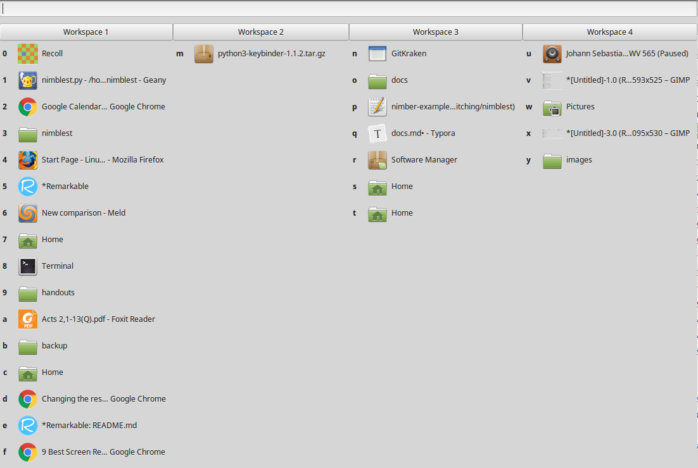

# Nimblest

This is a fork of [Frenzie's python "Nimbler" window-switcher](https://github.com/Frenzie/nimbler), with an initial implementation of  a text-searching feature which the other lacked. (This feature is toggled by the "/" key).

Nimblest is a GTK-based window switcher that is even nimbler than Nimbler. It is activated with a hotkey (default: `F10`; can be changed with a "win.ini"-style config file, such as in `~/.nimblest.conf`--see example [`nimblest-example.conf`](nimblest-example.conf)) which shows you a list of open windows ordered by workspace. You can switch quickly to the desired window using the shortcut displayed in front of the window, or by clicking on a window. Workspaces can be activated using `F1` through `F12`. The list of windows also allows clicking at any time.

## Screenshot and demo

## Changes
* v. 0.2 (11-12-2018): Text-searching now implemented. The search box is toggled with the "/" key. Press "enter" to activate the best match. Or press "/" again to close the search box and then type a shortcut from the results list.

## TO-DO
* Update documentation
* Keyboard navigation of window list using arrow keys
* Make searching more efficient? (Cached window list instead of re-creating entire list with each keystroke?) 
* Finish other projects from which this one is a nice distraction.

## Documentation

The older "Nimbler" documentation is available within the `docs` folder, but has not yet been updated. 
