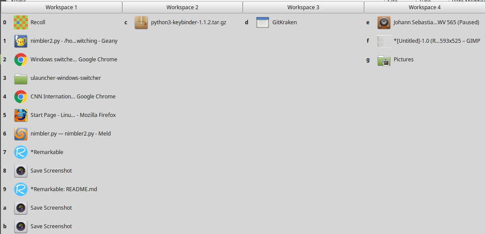

# Nimblest

This is a fork of [Frenzie's Nimbler window-switcher](https://github.com/Frenzie/nimbler), with an initial implementation of  a text-searching feature. (Currently togged by "/" key).

Nimblest is a GTK-based window switcher that is even nimbler than Nimbler. It is activated with a hotkey (default: `F10`; can be changed with a "win.ini"-style config file, such as in `~/.nimbler.conf`--see example `nimbler-example.conf`), upon which it shows you a list of open windows ordered by workspace. You can switch quickly to the desired window using the shortcut displayed in front of the window. Workspaces can be activated using `F1` through `F12`. The list of windows also allows clicking and navigation with the arrow keys.

## Changes
Text-searching now implemented. The search box is toggled with the "/" key. Press "enter" to activate the best match.

## Latest Release

Please download the latest release from the **Releases** tab on GitHub.

## Documentation

The documentation is available within the `docs` folder. View it online on GitHub to see the rendered markdown.
